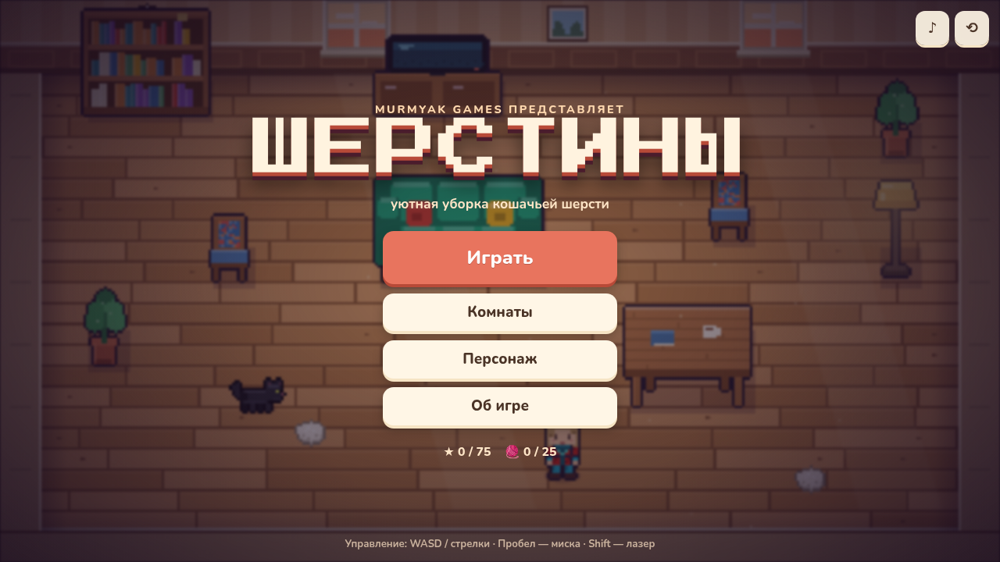
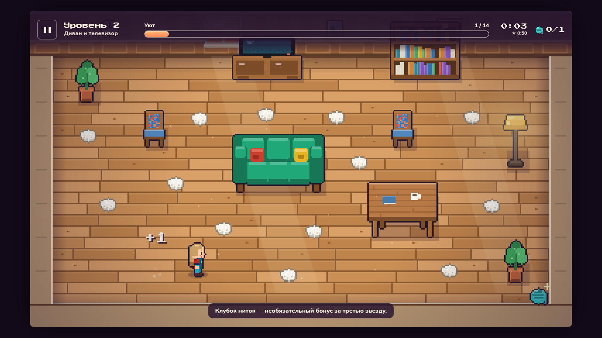
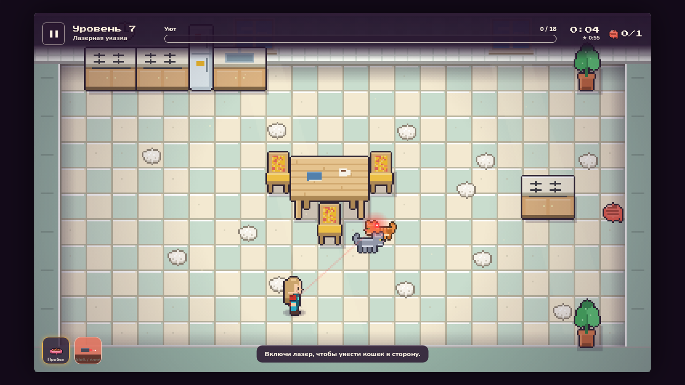
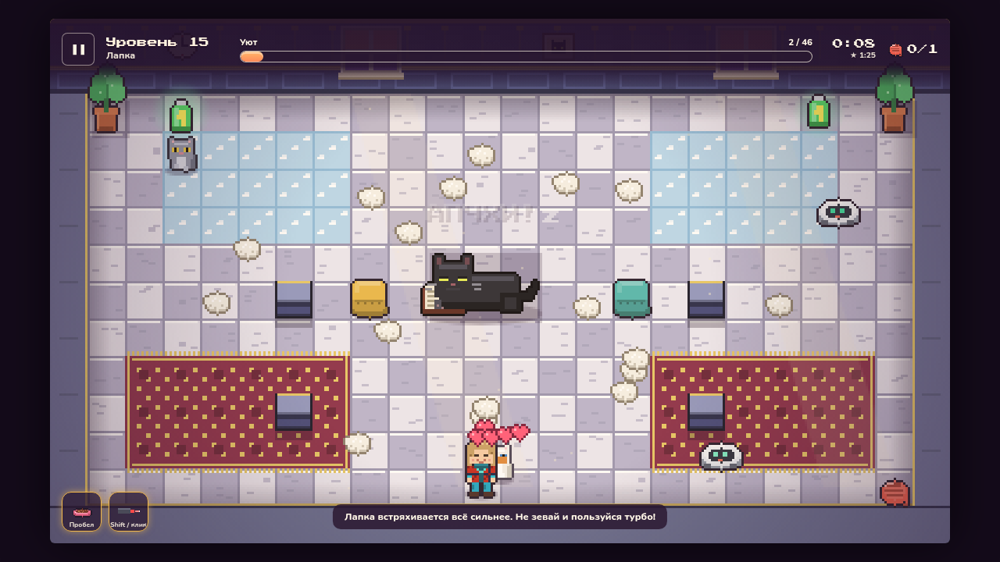

# Шерстины — MurMyak Games

Уютная пиксельная игра про уборку кошачьей шерсти. Играется в браузере, без сборки и зависимостей.

**Играть:** опубликованная версия на GitHub Pages (workflow `static.yml`) или локально:

```bash
npm start            # или: python3 -m http.server 8000
# открыть http://localhost:8000
```

Игра использует ES-модули, поэтому `index.html` нужно открывать через HTTP, а не через `file://`.






## Как играть

- **Цель комнаты:** собрать всю шерсть. Кошки продолжают линять, пока гуляют: комната убрана, когда шерсти не осталось совсем.
- **Звёзды:** 1 — комната убрана, 2 — уложился в «пар» времени, 3 — найден клубок ниток.
- **Управление:** WASD или стрелки; Пробел / E — поставить миску; Shift / F / клик мыши — включить и выключить лазерную указку (точка идёт за курсором); Esc / P — пауза; R — заново.
  На телефоне: плавающий джойстик слева, кнопки миски и лазера справа (играть лучше в горизонтальном положении).
- Кошку **нельзя спугнуть**, её можно только отвлечь миской или лазером.

## На телефоне

- Играть лучше в горизонтальном положении. На Android игра сама включает **полный экран** при первом касании (и фиксирует горизонтальную ориентацию); выключить и включить его можно кнопкой ⛶ в меню или в паузе. Если выйти из полного экрана самому, игра больше не включит его без вашей просьбы.
- На iPhone Safari не умеет полноэкранный режим для страниц. Нажмите «Поделиться» → «На экран Домой»: игра будет открываться как приложение, без адресной строки (в проекте есть `manifest.webmanifest`). На Android так тоже можно через «Установить приложение».
- Размер текста и кнопок интерфейса не опускается ниже читаемого, поэтому на маленьких экранах он крупнее самого игрового поля.

## Достижения и секретный код

В меню есть экран «Достижения»: 22 награды (уборка комнат, цепочки шерсти, кошки, миска, лазер, пуфики, роботы, клубки, звёзды, шапочки и одно секретное). У большинства есть полоса прогресса, получение сопровождается уведомлением прямо в игре.

**Секретный код:** комбинация `Ctrl + Shift + P` прямо во время игры сразу засчитывает текущую комнату, если она не получается (на Mac работает и `⌘ + Shift + P`). Комната засчитывается с одной звездой: звёзды за скорость и клубок, достижения и счётчики при этом не начисляются (кроме секретного достижения), а честное прохождение позже снимает пометку. На телефоне без клавиатуры кода нет. В Firefox это сочетание открывает приватное окно, там код недоступен.

## Структура мира

15 комнат, по три на мир: вводная, серединная и финальная.

| Мир | Комнаты | Новое |
|---|---|---|
| 1. Гостиная | 1–3 | сбор шерсти, мебель, ковёр замедляет, клубок ниток |
| 2. Спальня | 4–6 | линяющие кошки и обнимашки, миска, спящая кошка перекрывает проход |
| 3. Кухня | 7–9 | лазерная указка, пуфики, которые можно двигать |
| 4. Кабинет | 10–12 | скользкий пол, робот-пылесос, турбо-магнит |
| 5. Особняк | 13–15 | всё вместе, тесный чердак и финальная Лапка |

**Шапочки** открываются за локации: убрал все комнаты мира — получил шапочку этого мира (колпак повара за кухню, корона за особняк и так далее). Ещё две шапочки — за найденные клубки. Выбор — в меню «Персонаж».

## Устройство кода

```
index.html, css/        страницы и интерфейс (DOM поверх canvas)
js/defs.js              константы, размеры мебели, настройки баланса (CFG)
js/world.js, cats.js    игровая логика комнаты (без DOM, запускается и в Node)
js/levels.js            15 комнат; конструктор room() не даёт ставить предметы друг на друга
js/sprites_*.js, px.js  весь пиксель-арт рисуется кодом
js/render.js            отрисовка, частицы, свет
js/audio.js             музыка из файла и синтезированные эффекты
js/achievements.js, rewards.js  достижения и шапочки
js/save.js              сохранения (localStorage)
js/main.js              экраны, цикл игры, HUD
tests/validate.mjs      проверка уровней
tests/features.mjs      проверка читкода и достижений
```

Новый уровень: добавьте `add({...}, room()...)` в `js/levels.js`, затем запустите проверку.

## Проверка уровней

```bash
npm test                              # статика + бот проходит все комнаты
node tests/validate.mjs --ascii 12    # нарисовать комнату 12 текстом
node tests/validate.mjs --play --only 15 --dump   # прогон одной комнаты с картой при неудаче
node tests/validate.mjs --par         # подсказка по значениям «пар»
```

`tests/room.html?l=12` показывает комнату без интерфейса (для проверки графики).

## Благодарности и лицензии

Сделано с любовью ❤️ Геймдизайн — Антон и Мария Мерзляковы, анимация — Мария Мерзлякова, разработка — Антон Мерзляков, КОТент-мейкер — Лапка.
Шрифты Press Start 2P и Nunito распространяются по лицензии SIL OFL (см. `fonts/`).
